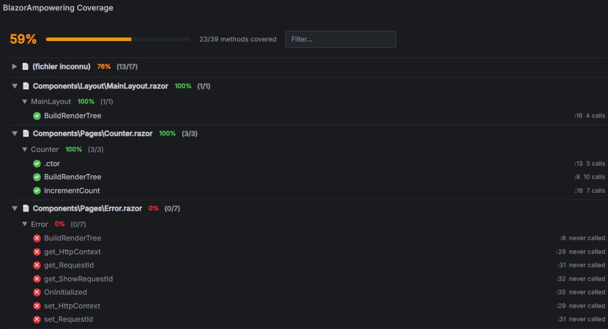

# BlazorAmpowering — Production Code Coverage Panel

A Grafana panel plugin that visualizes **production code coverage** for .NET and Blazor applications.  
It displays a collapsible file → class → method tree with hit/miss status, call counts, and coverage percentages — updated live from Prometheus metrics.

---

## What it shows



- **Global coverage percentage** with a color-coded progress bar (green ≥ 80 %, orange ≥ 50 %, red < 50 %)
- **File → class → method tree**, collapsible, sorted alphabetically
- **Per-method indicators**: ✓ (called at least once) / ✕ (never called), call count, source line number
- **Per-file and per-class coverage** percentages and ratios
- **Live search** to filter by method name, class or file

---

## Requirements

| Requirement | Details |
| --- | --- |
| Grafana | ≥ 10.0.0 |
| Prometheus / Mimir | Any recent version |
| .NET app instrumented with | `BlazorAmpowering.Coverage` + `BlazorAmpowering.Coverage.Runtime` |

The panel consumes two Prometheus metrics produced by the [BlazorAmpowering.Coverage.Runtime](https://www.nuget.org/packages/BlazorAmpowering.Coverage.Runtime/) NuGet package:

| Metric | Description |
| --- | --- |
| `coverage_method_hit` | `1` if the method was called at least once since startup, `0` otherwise |
| `coverage_method_calls_total` | Total number of calls since startup |

Both metrics carry the labels `method_id`, `class`, `method`, `file`, and `line`.

---

## Installation

### Option A — Grafana Marketplace

Search for **BlazorAmpowering** in **Administration → Plugins** and click Install.

### Option B — Manual (local / unsigned)

1. Download the latest release ZIP from the [GitHub releases page](https://github.com/gde59/BlazorAmpowering.Grafana/releases)
2. Extract to your Grafana plugins directory:
   - Linux/macOS: `/var/lib/grafana/plugins/blazorampowering-panel/`
   - Windows: `C:\Program Files\GrafanaLabs\grafana\data\plugins\blazorampowering-panel\`
3. Allow the unsigned plugin in `grafana.ini`:

```ini
[plugins]
allow_loading_unsigned_plugins = blazorampowering-panel
```

1. Restart Grafana.

---

## Instrument your .NET application

### 1. Add the Fody weaver to every project to measure

```shell
dotnet add package BlazorAmpowering.Coverage
```

Create `FodyWeavers.xml` at the root of each instrumented project:

```xml
<?xml version="1.0" encoding="utf-8"?>
<Weavers xmlns:xsi="http://www.w3.org/2001/XMLSchema-instance"
         xsi:noNamespaceSchemaLocation="FodyWeavers.xsd">
  <BlazorAmpowering.Coverage />
</Weavers>
```

### 2. Add the runtime to the entry project

```shell
dotnet add package BlazorAmpowering.Coverage.Runtime
dotnet add package BlazorAmpowering.Observability
```

```csharp
// Program.cs
builder.AddBlazorTelemetry();      // registers the coverage meter inside WithMetrics()
builder.AddProductionCoverage();   // starts the IHostedService that publishes instruments
```

> `AddBlazorTelemetry()` must be called **before** `AddProductionCoverage()`.

---

## Configure the panel

Add a new panel to your dashboard and select **BlazorAmpowering** as the visualization type.

### Queries

Add two queries in the query editor:

**Query A — Hit (ref ID: `A`)**

```promql
coverage_method_hit{service_name="$service_name"}
  * on(method_id) group_left(class, method, file, line)
  coverage_method_info{service_name="$service_name"}
```

**Query B — Total calls (ref ID: `B`)**

```promql
coverage_method_calls_total{service_name="$service_name"}
  * on(method_id) group_left(class, method, file, line)
  coverage_method_info{service_name="$service_name"}
```

Set **Format** to `Time series` for both queries.

### Panel options

| Option | Default | Description |
| --- | --- | --- |
| Ref ID — Hit | `A` | Query ref ID for `coverage_method_hit` |
| Ref ID — Total calls | `B` | Query ref ID for `coverage_method_calls_total` |

### Dashboard variable (Service dropdown)

Add a variable named `service_name` of type **Query**:

```promql
label_values(coverage_method_info, service_name)
```

This populates the dropdown with every instrumented service that has sent metrics.

---

## PromQL — useful queries

### Overall coverage percentage

```promql
count(coverage_method_hit{service_name="my-app"} == 1)
  / count(coverage_method_hit{service_name="my-app"}) * 100
```

### Never-called methods (dead code candidates)

```promql
coverage_method_hit{service_name="my-app"} == 0
  * on(method_id) group_left(class, method, file, line)
  coverage_method_info{service_name="my-app"}
```

### Most called methods

```promql
topk(10, coverage_method_calls_total{service_name="my-app"}
  * on(method_id) group_left(class, method, file, line)
  coverage_method_info{service_name="my-app"})
```

---

## Disclaimer

This plugin is provided free of charge, as is, with no warranty of any kind and no committed support.  
Community issues and pull requests are welcome on [GitHub](https://github.com/gde59/BlazorAmpowering.Grafana).

## License

Apache 2.0 — Copyright 2026 Gaetan Delpierre
